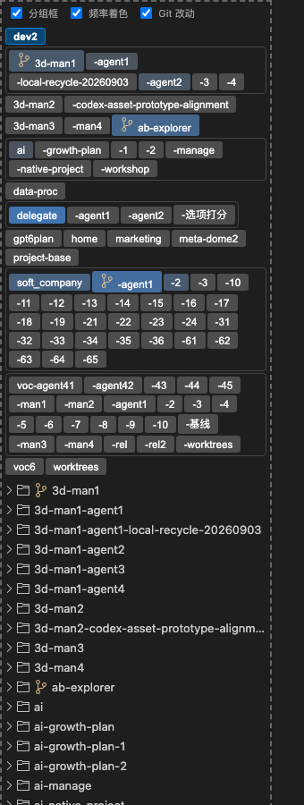

# AB Explorer

VS Code 资源管理器的替代实现：A 区用横向标签展示当前层级的子目录，B 区展示层级树；
根据 B 区是否需要滚动条，在"标签导航"和"逐级下钻"两种显示模式之间自动切换。



## 安装

尚未上架 VS Code Marketplace，从源码本地打包安装：

```bash
git clone https://github.com/yinrong/ab-explorer.git
cd ab-explorer
npm install
npm run build
npx vsce package
code --install-extension ab-explorer-0.1.0.vsix
```

装好后重启一次 VS Code，活动栏左侧会出现 AB Explorer 的独立图标。

## 功能

### 双区导航

A 区是一排横向标签，代表当前层级下的子目录，点一下切换到那个目录，B 区展示它的
完整层级树。B 区不需要滚动条时 A 区只有一行；B 区出现滚动条时 A 区自动补一行标签，
把当前路径摊开显示。

### 目录名前缀压缩

`typhur-app`、`typhur-web`、`typhur-api` 这种同前缀目录，第一个显示全名，
其余压缩成 `-app`、`-web`（悬停显示全名）。压缩会找到最短、最不重复的差异部分：
`3d-man1` / `3d-man1-agent1` 这种嵌套命名、`ai` / `ai-growth-plan` /
`ai-growth-plan-1` 这种递进命名、`agent1` / `agent10` / `agent11` 这种数字
编号，都各自处理；只共享一小段前缀的旁支目录（如 `3d-man1` 和 `3d-man2`）
不会被并进同一组。同前缀标签数较多时外面加一圈边框标出这是一组，边框内部
自动换行。

### 按活跃度着色

A 区标签按活跃度着色，用同一色系改变浓淡。活跃度计入插件内的点击次数，
也计入该目录最近 14 天作为 git 仓库根的提交数——这些提交可能是在编辑器
之外用命令行或其他工具产生的。

### git 改动标记

某个子目录本身是一个 git 仓库且有未提交改动时，名字前显示 VS Code「源代码管理」
同款的分支图标。提交后图标消失。

### 文件操作

新建文件/文件夹、重命名、删除（进系统回收站）、在系统文件管理器中显示、
复制路径，右键 A 区标签或 B 区树里的行都能用。外部改动文件后视图自动刷新。

### 功能开关

顶部三个开关分别控制分组边框、活跃度着色、git 改动图标，选择按 workspace
保存。双区导航、标签压缩、右键操作不受这三个开关影响。
